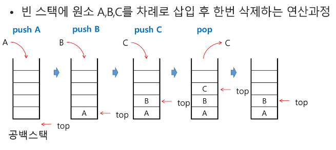
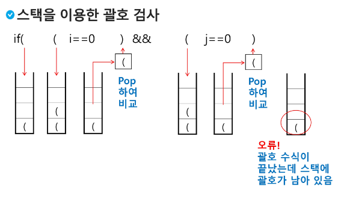
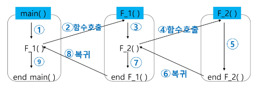
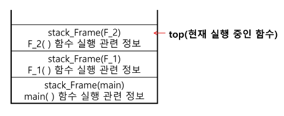
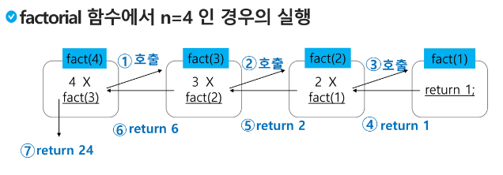
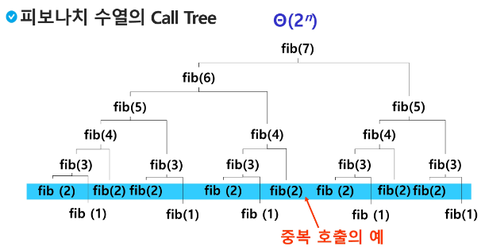

# **알고리즘_8일차** (2/7)

# 알고리즘 복습 방법
쉬운 문제도 다시 복습, 더 빠르고 정확하게 풀 수 있도록.  
헷갈렸던 문제는, 전 코드 보지 않고 풀 수 있도록.  
문제당 한 번 보는 시간을 줄이고, 횟수를 늘려라.  

## **목차**
### **스택1**
1. 스택
2. 재귀호출
3. Memoization
4. DP
5. DFS

---

## **1. 스택**

### **1-1. 스택의 특성** 
> 물건을 쌓아 올리듯 **자료를 쌓아 올린 형태의 자료구조**

> 스택에 저장된 자료는 **선형 구조**  
> 선형구조 : 자료 간의 관계가 **1대1의 관계**  
> 비선형구조 : 자료 간의 관계가 1대N의 관계  

> 스택에 자료를 삽입하거나 스택에서 자료를 꺼낼 수 있다.  
> **마지막에 삽입한 자료를 가장 먼저 꺼낸다.   
> (후입선출법, LIFO)**

---

### **1-2. 자료구조와 연산**
> 스택을 프로그램에서 구현하기 위해서 필요한 자료구조와 연산

#### **1. 자료구조**  
> 자료를 선형으로 저장할 저장소  
> 배열을 사용할 수 있다.  
> 저장소 자체를 스택이라 부르기도 한다.  
> 마지막 삽입된 원소의 위치를 top이라고 부른다.

#### **2. 연산** 
> 삽입 : 저장소에 자료를 저장 (push라고 부름)  
> 삭제 : 저장소에서 자료를 꺼냄 (pop이라고 부름)  
> (꺼낸 자료는 삽입한 자료의 역순으로 꺼냄)  
> isEmpty : 스택이 공백인지 아닌지를 확인하는 연산  
> peek : 스택의 top에 있는 item(원소)을 반환하는 연산  

---

### **1-3. 스택의 삽입/삭제 과정**
> 빈 스택에 원소 A, B, C를 차례로 삽입 후 한번 삭제하는 연산과정



---

### **1-4. 스택의 push 알고리즘**
> append 메소드를 통해 리스트의 마지막에 데이터를 삽입
```python
def push(item):
    s.append(item)

def push(item, size):
    global top
    top += 1
    if top == size:
        print('overflow!')
    else:
        stack[top] = item

size = 10
stack = [0] * size
top = -1

push(10, size)
top += 1    # push(20)
stack[top] = 20
```

---

### **1-5. 스택의 pop 알고리즘**

```python
def pop():
    if len(s) == 0:
        # underflow
        return
    else:
        return s.pop()

def pop():
    global top
    if top == -1:
        print('underflow')
        return -
    else:
        top -= 1
        return stack[top+1]
print(pop())

if top > -1:   # pop()
    top -= 1
    print(stack[top+1])
```

---

#### **강의 스택 코드 실습**
> 10, 20, 30 순으로 넣었으나 출력은 30, 20, 10 순으로 나옴
> 
```python
def push(n):
    global top
    top += 1
    if top == size:
        print('overflow')
    else:
        stack[top] = n

top = -1
size = 10
stack = [0] * 10    # 최대 10개 push


top += 1            # push(10)
stack[top] = 10

top += 1            # push(20)
stack[top] = 20

push(30)

while top >= 0:
    top -= 1
    print(stack[top+1])
``` 


---

### **1-6. 스택의 응용1**

#### **스택 구현 고려 사항**
> 1차원 배열을 사용하여 구현할 경우 구현이 용이하다.  
> 단점 : 스택의 크기를 변경하기 어렵다.

> 해결방법 : 저장소를 동적으로 할당하여 스택을 구현하는 방법  
> 동적 연결리스트를 이용하여 구현하는 방법을 의미한다.  
> 구현이 복잡하지만, 메모리를 효율적으로 사용한다.

---

#### **괄호검사**
> 괄호의 종류 : 대괄호[ ], 중괄호{ }, 소괄호( )

> **괄호의 조건**  
조건1 : 왼쪽 괄호 개수 = 오른쪽 괄호 개수  
조건2 : 같은 괄호에서 왼쪽 괄호는 오른쪽 괄호보다 먼저 나와야 함  
조건3 : 괄호 사이에는 포함 관계만 존재

---

#### **스택을 이용한 괄호 검사**
> **괄호를 조사하는 알고리즘 개요**  
> 
> 문자열에 있는 괄호를 차례대로 조사하면서,  
> 왼쪽 괄호를 만나면 스택에 삽입하고,   
> 오른쪽 괄호를 만나면 스택에서 top 괄호를 삭제한 후,   
> 오른쪽 괄호와 짝이 맞는지를 검사한다.
>
> 이때 스택이 비어 있으면 조건1 또는 조건2에 위배되고,  
> 괄호의 짝이 맞지 않으면 조건3에 위배된다.  
>
> 마지막 괄호까지 조사한 후에도 스택에 괄호가 남아있으면 조건1에 위배된다.



---

### **1-7. 스택의 응용2**

#### **Function call**
> 프로그램에서의 함수 호출과 복귀에 따른 수행 순서를 관리  
> 
> 가장 마지막에 호출된 함수가 가장 먼저 실행을 완료하고 복귀하는 후입선출 구조이므로,  
> 후입선출 구조의 스택을 이용하여 수행순서 관리
> 



> 함수 호출이 발생하면 호출한 함수 수행에 필요한 지역변수, 매개변수 및 수행 후 복귀할 주소 등의 정보를 스택 프레임(stack frame)에 저장하여 시스템 스택에 삽입



> 함수의 실행이 끝나면 시스템 스택의 top원소(스택 프레임)를 삭제(pop)하면서 프레임에 저장되어 있던 복귀주소를 확인하고 복귀  
>
> 함수 호출과 복귀에 따라 이 과정을 반복하여 전체 프로그램 수행이 종료되면 시스템 스택은 공백 스택이 된다.  


---

#### **함수 호출과 복귀에 따른 전체 프로그램의 수행 순서**


---


## **2. 재귀호출**
> 필요한 함수가 자신과 같은 경우 자신을 다시 호출하는 구조  
 
> 함수에서 실행해야 하는 작업의 특성에 따라 일반적인 호출방식보다 재귀호출방식을 사용하여 함수를 만들면 프로그램의 크기를 줄이고 간단하게 작성  

---

### **2-1. n에 대한 factorial**
> 1부터 n까지의 모든 자연수를 곱하여 구하는 연산
> 
```python
n! = n x (n-1)!
    (n-1)! = (n-1) x (n-2)!
    (n-2)! = (n-2) x (n-3)!
...
    2! = 2 x 1!
    1! = 1
```
마지막에 구한 하위 값을 이용하여 상위 값을 구하는 작업을 반복  

#### **factorial 함수에서 n=4인 경우의 실행**


---

### **2-2. 피보나치 수열 재귀함수**
> 피보나치 수열 : 0과 1로 시작하고 이 전의 두 수 합을 다음 항으로 하는 수열  
> 0, 1, 1, 2, 3, 5, 8, 13  

> 피보나치 수열의 i번째 값을 계산하는 함수F  
> $F_{0} = 0, F_{1} = 1$  
> $F_{i} = F_{i-1} + F_{i-2}$ for i >= 2

> 피보나치 수를 구하는 재귀함수
```python
def fibo(n):
    if n < 2:
        return n
    else:
        return fibo(n-1) + fibo(n-2)
```

---


## **3. Memoization**
> 컴퓨터 프로그램을 실행할 때 이전에 계산한 값을 메모리에 저장해서 매번 다시 계산하지 않도록 하여 전체적인 실행속도를 빠르게 하는 기술  

> 동적 계획법의 핵심이 되는 기술

> 글자 그대로 해석하면 '메모리에 넣기'라는 의미  
> 동사형은 memoize


### **3-1. 피보나치 수열에 Memoization 적용** 
> 피보나치 수열에는 엄청난 중복이 존재한다.
> 


> 앞의 예에서 피보나치 수를 구하는 알고리즘에서 fibo(n)의 값을 계산하자마자 저장하면(memoize), 실행시간을 $\theta$(n)으로 줄일 수 있다.

> Memoization 방법을 적용한 알고리즘  
```python
def fibo(n):
    global memo
    if n >= 2 and memo[n] == 0:
        memo[n] = fibo(n-1) + fibo(n-2)
    return memo[n]

memo = [0] * (n+1)
memo[0] = 0
memo[1] = 1
# memo를 위한 배열을 할당하고, 모두 0으로 초기화한다.
# memo[0]을 0으로 memo[1]은 1로 초기화한다.
```

---


## **4. DP (Dynamic Programming)**
> 동적 계획 알고리즘은 그리디 알고리즘과 같이 **최적화 문제**를 해결하는 알고리즘이다.  

> 먼저 입력 크기가 작은 부분 문제들을 모두 해결한 후,  
> 그 해들을 이용하여 보다 큰 크기의 부분 문제들을 해결하여,  
> 최종적으로 원래 주어진 입력의 문제를 해결하는 알고리즘이다.  

### **4-1. 피보나치 수 DP 적용**
> 피보나치 수는 부분 문제의 답으로부터 본 문제의 답을 얻을 수 있으므로 최적 부분 구조로 이루어져 있다.  

#### 1. 문제를 부분 문제로 분할한다.  
> Fibonacci(n) 함수는 Fibonacci(n-1)과 Fibonacci(n-2)의 합  
 
> Fibonacci(n-1)은 Fibonacci(n-2)와 Fibonacci(n-3)의 합  

> Fibonacci(2)는 Fibonacci(1)과 Fibonacci(0)의 합  

> Fibonacci(n)은 Fibonacci(n-1), Fibonacci(n-2), ... Fibonacci(2), Fibonacci(1), Fibonacci(0)의 부분집합으로 나뉜다.

#### 2. 부분문제로 나누는 일을 끝냈으면 가장 작은 부분 문제부터 해를 구한다.

#### 3. 그 결과는 테이블에 저장하고, 테이블에 저장된 부분 문제의 해를 이용하여 상위 문제의 해를 구한다.  


